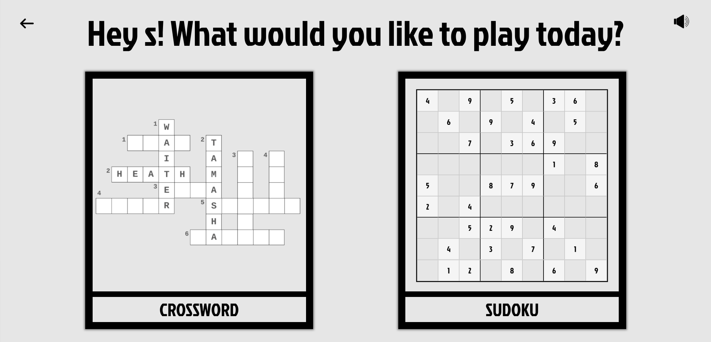

# **BOXES** 

  

Welcome to Boxes, a web-based game that offers two classic puzzles to challenge and entertain you: Crossword and Sudoku. Whether you're a crossword enthusiast or a sudoku master, Boxes has something for everyone. Enjoy hours of fun solving puzzles and sharpening your mind.

  

Boxes has 2 parts

*   [Crossword](##CROSSWORD)

*  [Sudoku](##SUDOKU)

  

You can choose either of the two and start having some fun!

  

In the Main and opening page of the game you have to enter your Name and Nickname (name cant cotain any numberds in it.)

  

Then on the next page you have to option to either choose CROSSWORD or SUDOKU

  
  
  

## CROSSWORD

  

### Rules

  

The game of crossword is pretty simple. You main objective is to guess the coorect word by the clue given. There will be empty boxes where your letters will appear if they are correct. For example -

  

Question - Name the movie directed by Imtiaz Ali starring Ranbir Kapoor and Deepika Padukone **(7)**

  

Answer - **Tamasha**

  

You have to give your best guess and type it in the given input box. 

  

### Gameplay

  After clicking on "Check" or pressing the enter key, the answer will be displayed on the main grid of the crossword. To help you more in this the number of letters in the answer will be displayed right next to the hint in round brackets.

  

You can even check out the instructions page for a better understanding of the same.

I have made 3 themes for crossword. Out of these 3 you can choose any one. The themes are as follows

- **Movies**

- **Places**

- **Sports**

  

### Result

  

While playing the score will be calculated and displayed in the final Results page. The result will consist of 4 parts:

- **Percent** of crossword completed

- **Time** (Mins and Second)

- **Errors** (Number of errors commited while solving)

- **Moves** (Moves taken for you to solve the game)

  
  
  

## SUDOKU

  

Sudoku is a game that tests your concentration skills and helps you boost it.

  

### Rules

  

There will be a 9 x 9 Grid. This grid will be partially filled. Your main aim is to completely fill this grid while following some rules like -

  

1. There can only be one of each number (1 to 9) in every row.

2. There can only be one of each number (1 to 9) in every column.

3. The grid is divided into 9 smaller parts. Each square shall contain only one of each number as well.

4. By using your logic you have to guess correctly where a number should be placed.

  

### Gameplay

To insert a number in a given cell of grid you can select a digit from the right hand side of the grid. Then click on the desired cell to place it.

  

If the number doesnt belong there the error will increase by one. Try to complete the puzzle is the least possible time.

  

To have a more variety of users I have ensured to inculde different levels on this sudoku. The three different levels are:

- Easy (Will contain more starting numbers to help begineers)

- Medium (Will have a limited number of starting numbers to help improve sudoku skills)

- Hard (You have to make guesses while playing this. Made only for Advanced Players.)

  

### Result

  

While playing the score will be calculated and displayed in the final Results page. The result will consist of 4 parts:

- Percent of crossword completed

- Time (Mins and Second)

- Errors (Number of errors commited while solving)

  
  
  

## FEATURES

  

Some of the features I have included in this website are

- AUDIO - There will be audio effects and a background Music aswell.

- MUTE BUTTON - There is a Mute button which will mute the audio.

- SCORE - Score will have multiple stats to analyse the peformace.

- VARIETY - There are 30 different sudoku puzzles. out of these 30 One will be selected according to the difficulty choosen. Every time you click on NEW GAME a new sudoku will appear.

- TIMER - Timer is included to help the user know the time taken by them to complete the puzzle.

- RESPONSIVE - Website is responsive in mobile devices

  
  
  
  

## LINKS:

  

- Github Repo Link : https://github.com/shaaaaz/boxes

  

- Deployed Link : https://shaaaaz.github.io/boxes/

  

- Figma Design Link : https://www.figma.com/file/kcWRvlRPYOCHt87UmQyC4X/BOXES-by-Shaaz--Prototype-(Copy)?type=design&node-id=0%3A1&mode=design&t=LyPsPvXdj2La2TXc-1

## SCREENSHOTS

 
 
 
 
 
 
 
 
 
 
 
 

